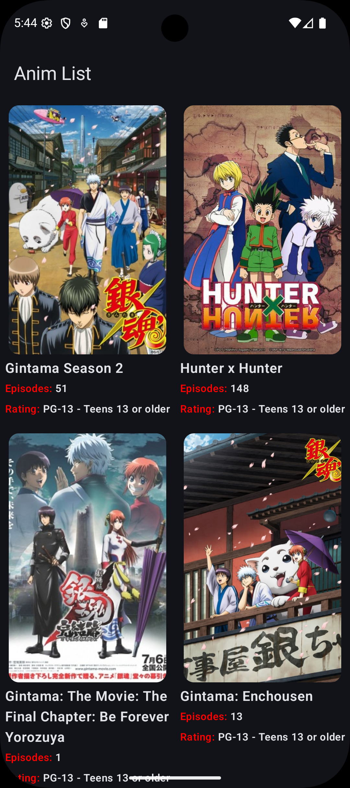
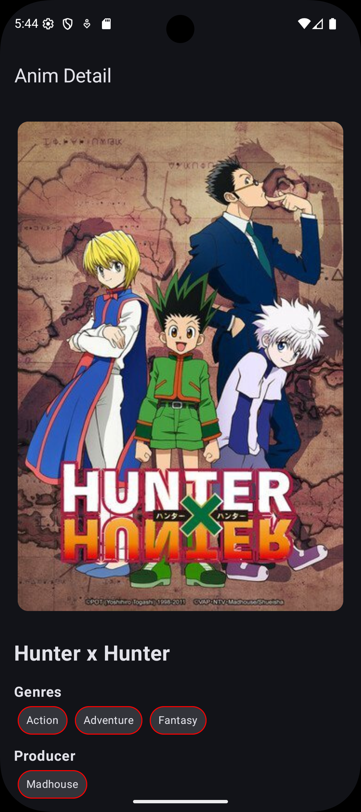

# 📱 Anime Explorer App

A simple Android app built with **Jetpack Compose** that uses the **Jikan API (MyAnimeList)** to fetch and display a list of anime series, along with detailed views.

---

## ✨ Features

- 📺 Browse popular anime series
- 🔍 View detailed anime information
- ⚡ Smooth and reactive UI
- 📡 Works both **online and offline**

---

## 📸 Screenshots

<p align="center">
  
  
  
</p>

---

## 📦 Offline Support

- 💾 Uses **Room Database** for local caching
- 📴 Fully functional in **offline mode**

---

## 🏗️ Architecture

- 🧩 **MVVM (Model–View–ViewModel)**
- 🔄 Clean separation of concerns
- 📊 Reactive UI using **StateFlow**
- 📄 Pagination handled via **Paging 3**

---

## 🛠️ Tech Stack & Libraries

- 🎨 **Jetpack Compose** – UI
- 🌐 **Ktor Client** – Network calls
- 🗄️ **Room** – Local database
- 📚 **Paging 3** – Pagination
- 🖼️ **Coil** – Image loading
- 🔌 **Koin** – Dependency Injection
- 🔄 **Kotlinx Serialization / Gson** – JSON parsing
- 🧭 **Navigation Compose** – App navigation

---

## 🚀 Getting Started

### Prerequisites

- Android Studio (latest version recommended)
- Minimum SDK: 24+

### Installation

1. Clone the repository

```bash
git clone https://github.com/your-username/your-repo-name.git